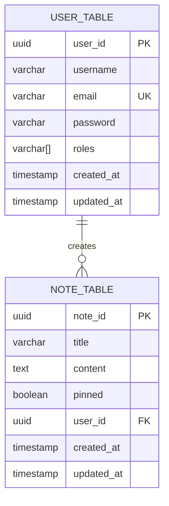

# ˗ˏˋ User Notes Manager ˎˊ˗
_Simple web application for note management._

## 📁 Table of contents 📁
**-** [Key features](#-key-features-)</br>
**-** [Tech stack](#-tech-stack-)</br>
**-** [Database schema](#-database-schema-)</br>
**-** [Quickstart](#-quickstart-)</br>

## ✨ Key features ✨
### User management:
- 🔑 Registration and authentication with JWT
- 👥 Role-based access control
### Note management
- ➕ Create/edit notes
- ✔️ Mark notes as pinned
- ✖️ Delete notes
### Smart notifications
- 📧 Send welcome email

## ⚙️ Tech Stack ⚙️
| **Category**       | **Technologies**                                                 |
|----------------|--------------------------------------------------------------|
| **Backend**        | Java 21, Spring Boot 4, Web, Data JPA, Security, Kafka, Mail |
| **Database**       | PostgreSQL, Liquibase                                        |
| **Infrastructure** | Docker, Docker Compose                                       |
| **Build Tool**     | Gradle Kotlin DSL                                            |
| **Testing**        | JUnit 5, Mockito, Testcontainers                             |

## 🖥 Database schema 🖥


## ⚡ Quickstart ⚡
1. Clone repository:
```bash
git clone https://github.com/SDdisk/user-notes-manager
cd user-notes-manager
```
2. Create environment file:
```bash
cp .env.example .env
```

3. Edit the `.env` file with your values.
```dotenv
# DATABASE
DB_USERNAME=your-db-username
DB_PASSWORD=your-db-password
DB_URL=jdbc:postgresql://postgres:5432/backend
DB_DRIVER_CLASSNAME=org.postgresql.Driver

# SECURITY
SECURITY_USERNAME=your-security-username
SECURITY_PASSWORD=your-security-password
# JWT
JWT_SECRET=your-secret-jwt-key-change-it-123-123-123-123

# KAFKA
KAFKA_BOOTSTRAP_SERVER=kafka:9090

# MAIL_CREDS
MAIL_USERNAME=your-email@gmail.com
MAIL_PASSWORD=your-app-password
```

4. Start the application:
```bash
docker compose up -d --build 
```

5. Stop the application:
```bash
docker compose down
```